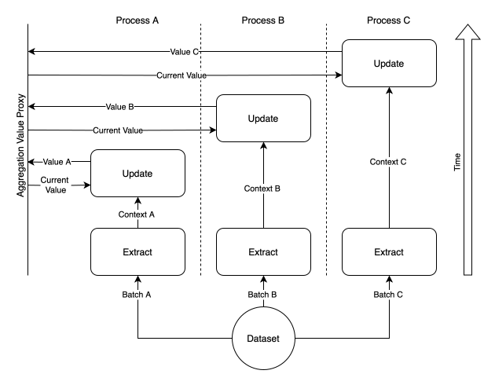

Data Aggregators
================

Data aggregators are a crucial component of the data flow architecture, serving as one of the three primary types of nodes within a data flow. Specifically, data aggregator nodes implement dataset-wide computations, such as calculating the sum, mean, or standard deviation of features across all examples in a dataset. Unlike data processors that operate on individual examples, data aggregators focus on aggregating values from multiple examples to compute summary statistics or other collective metrics.

:code:`Hyped` includes a variety of pre-built, general-purpose data aggregators designed to perform common statistical operations. These aggregators provide robust solutions for calculating dataset-wide metrics, enabling users to easily integrate these computations into their data processing pipelines.

Design Principles
-----------------

- **Thread-Safety**: Data aggregators ensure thread-safety to handle concurrent access and updates to shared resources. This prevents race conditions and maintains the integrity of aggregated data, enabling reliable operation in multi-threaded environments.
- **Efficient Computation**: To achieve computational efficiency, data aggregators separate the extraction and update phases of aggregation. Asynchronous and parallel extraction maximizes resource utilization, while synchronous and thread-safe updates ensure data integrity. This approach balances performance optimization with concurrency control, enabling scalable and responsive aggregation processes.

Data aggregators also adhere to the design principles for data processors, ensuring modularity, isolation, configurability, and clear, type-safe input/output definitions to facilitate seamless integration into diverse data flow architectures.

Execution Model
---------------

Data aggregators operate through a series of well-defined steps that ensure efficient and accurate aggregation of values across the dataset.

The figure below illustrates the workings of the extraction and update phase. It highlights the concurrent execution of the extraction phase alongside the synchronized processing of the update phase which guarantees the integrity of the aggregation outcome.

This logic is implemented by the :doc:`DataAggregationManager <api/hyped.core.nodes.aggregator>`.

Seeding Phase
~~~~~~~~~~~~~~~~~~~~

Before the aggregation process begins, data aggregators undergo a seeding phase to set up their internal state. During this phase, the aggregator initializes its state, which includes any parameters or configurations specified by the user. This phase ensures that the aggregator is ready to start processing data and can maintain consistent behavior throughout the aggregation process.

Extraction Phase
~~~~~~~~~~~~~~~~

The extraction phase is where data aggregators retrieve relevant information from the input data batch. Operating asynchronously and often in parallel, this phase maximizes resource utilization and computational efficiency, especially in multi-process environments. Aggregators extract data from each example in the batch, focusing on the features specified for aggregation. For instance, in the case of calculating the sum of numerical features, the extraction phase precomputes the sum of the given input batch.

Update Phase
~~~~~~~~~~~~

Once the relevant information is extracted, the update phase triggers to incorporate this information into the aggregator's current state. The update phase is responsible for aggregating values accumulated during the extraction phase, updating the aggregator's internal state accordingly. Thread-safe mechanisms ensure that updates occur reliably, even in concurrent or multi-threaded settings, preventing data corruption or inconsistency.

