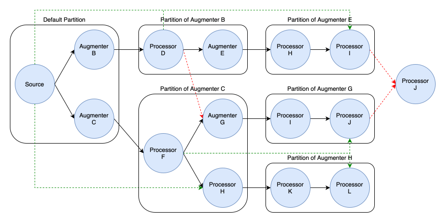

Data Augmentors
===============

Data Augmentors are the second type of node within the data flow architecture, designed to expand or reduce the dataset by generating new samples or filtering existing ones. Unlike data processors, which transform individual examples without altering dataset size, augmentors may modify the dataset's size by creating variations or removing samples. 

:code:`Hyped`'s augmentation framework is highly flexible, enabling augmentation nodes to be placed anywhere within the data flow graph. This flexibility ensures that augmentation can be seamlessly integrated into any stage of the data processing pipeline.

Design Principles
-----------------

- **Validation**: During the construction of the data flow, the framework automatically validates the graph to ensure that outputs from data augmentors are only combined with compatible values. This validation step prevents logical errors and ensures the integrity of the data flow, making it easier to integrate augmentation nodes without disrupting the overall process.
- **Seamless Integration**: The framework allows for the on-the-fly combination of augmentor outputs with compatible values. This seamless integration capability simplifies the use of augmentation nodes, enabling users to effortlessly enhance their data flows with minimal adjustments.

Data augmentors also adhere to the design principles for data processors, ensuring modularity, isolation, configurability, and clear, type-safe input/output definitions.

Flow Structure and Feature Compatibility
----------------------------------------

In the data flow architecture, maintaining a valid structure is crucial for ensuring consistent data processing and preventing errors. The framework enforces a specific structure based on the concept of partitions. A partition is defined as a subgraph within the data flow where the dataset size is guaranteed to remain constant. Each augmentor node introduces a new partition, as it may modify the dataset size by generating new samples or filtering existing ones.

To maintain a valid flow structure, the data flow must adhere to a tree-like structure at the partition level. This means that:

- **Tree Structure**: The outputs of any node within a partition should only flow into downstream partition. As long as the flow remains tree-like, the structure is considered valid.

- **Validation Mechanism**: During the construction of the data flow graph, the framework automatically validates the graph to ensure that these rules are followed. Any deviation from the tree structure, such as merging outputs from different partitions, will result in an invalid graph, which is flagged by the framework.

The diagram below illustrates an example of a valid data flow structure, including various partitions and connections. **Green lines indicate valid connections** where the tree structure is maintained, while **red lines indicate invalid connections** where incompatible outputs are combined, breaking the tree structure.

Note that the tree structure requirement applies only on partition-level. Within a partition, the data flow can be any DAG.

As seen above, a valid flow structure allows the flow of features from one (source) partition into downstream partitions. However, since dataset sizes can vary even between partitions on the same path, this poses a challenge. To address this, features from the source partition are processed along the path to the downstream partition. This process either duplicates or filters the features based on the operations of the data augmentor, ensuring the compatibility with the features in the downstream partiton.