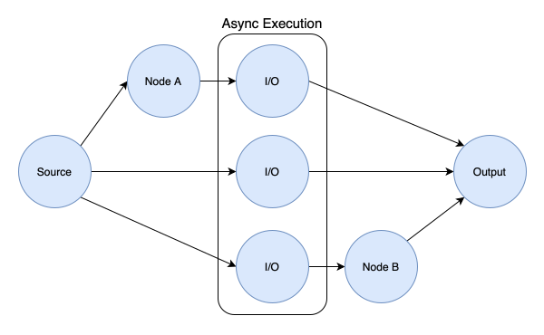
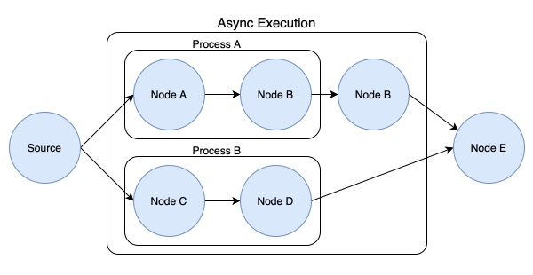

Data Flow
=========

Data Flows provides a structured way to organize and execute data processing tasks. It represents the sequence of operations applied to input data to produce an output. Data flows are modeled as Directed Acyclic Graphs (DAGs), where each node represents a processing step, and the edges denote the flow of data between these steps. This structure ensures that data flows are organized, manageable, and easy to visualize.

Structure of Data Flows
-----------------------

In Hyped, data flows are structured representations of the processing pipeline, consisting of nodes and edges that dictate the flow of data.

Directed Acyclic Graph (DAG)
~~~~~~~~~~~~~~~~~~~~~~~~~~~~
A Directed Acyclic Graph (DAG) is a graph with directed edges where no cycles exist. This ensures that data flows in a single direction from input to output without any loops, making the process straightforward and preventing infinite loops. Each node in the DAG represents a processing step, and the edges denote the flow of data between these steps.

In Hyped, the DAG structure ensures that data processing is organized and manageable. It allows for clear visualization of the processing pipeline, making it easier to understand and debug. The absence of cycles guarantees that each piece of data is processed exactly once in a defined order, enhancing the reliability and predictability of the data flow.

.. image:: ../_static/dag.svg

Nodes and Edges
~~~~~~~~~~~~~~~
Nodes serve as modular and configurable processing steps within a data flow, encapsulating specific operations or transformations applied to input data. Designed for flexibility and reusability, nodes are interconnected to form a DAG, enabling the creation of complex data processing pipelines. Each node operates as a coroutine, allowing for asynchronous execution and efficient utilization of computational resources. This design promotes code maintainability and scalability, facilitating the development of robust and scalable data processing workflows that optimize performance and throughput.

Edges in a data flow represent the pathways along which data moves between nodes. They denote the dependencies and sequence of operations, ensuring that data flows in a logical and structured manner. The edges also define the order in which nodes are executed, maintaining the integrity of the data processing pipeline.

Types of Nodes
~~~~~~~~~~~~~~
Nodes in a data flow can be of various types, each performing a specific function:

- **Source Node**: A Data Flow always has exactly one source node, representing the entry points of data into the flow. The data going into this node is provided from the dataset to be processed.
- **Data Processor Nodes**: Processor nodes apply transformations to the features of an isolated example in the dataset. This might include tokenization or normalization.
- **Data Augmentation Nodes**: Augmentation nodes generate or filter samples in the dataset, therby changing the size of the dataset. This might include operations like chunking sequences or filtering invalid samples.
- **Data Aggregator Nodes**: Aggregator nodes perform dataset-wide statistical operations on the features. This might include summation or averaging.

Partitions
~~~~~~~~~~

In a data flow, the underlying graph is divided into several partitions, which are essential for both bookkeeping and execution of the data flow. As the data flow executes, a batch of samples is processed through the graph, with nodes like aggregators or augmenters potentially altering the batch size, resulting in a dynamic batch size across different stages. However, within each partition, the batch size is guaranteed to be constant, allowing a steady and consistent data flow through the processing steps. This partitioning strategy enhances the efficiency of data flow management and execution, ensuring that each phase is handled in an organized and controlled manner.

Certain predefined partitions are present at most once in every data flow graph:

- **Constant Partition**: This partition contains all nodes that hold or compute constant values within the data flow. It includes nodes that introduce constant values as well as those performing operations solely on these constants.
- **Default Partition**: Assigned to the source node and its sub-graph, this is the standard partition for nodes that do not fall under any specific category. It serves as the default grouping for general processing steps in the data flow.
- **Aggregated Partition**: This partition comprises nodes that deal with aggregated values. It includes nodes that process the outputs of aggregator nodes, where dataset-wide statistical operations are performed.

In addition to these predefined partitions, the outputs of each data augmentation node introduce a new partition.

It is important to note that while data augmentation nodes introduce new partitions to the graph, they are not part of the partitions they create - they simply point to them. Similarly, aggregator nodes are not included in the aggregated partition — they only direct towards it.

.. image:: ../_static/partitions.svg

Execution Model
---------------

The execution model employed by the data flow architecture plays a crucial role in efficiently processing data and optimizing performance. This section provides an overview of the execution model and explores how asynchronous execution and parallelization are leveraged to enhance efficiency.

Batch Processing
~~~~~~~~~~~~~~~~

Batch processing is a fundamental aspect of the data flow execution model, facilitating the efficient handling of large datasets. In batch processing, a batch of samples flows through the data flow graph, rather than individual samples, enhancing computational efficiency and resource utilization.

Within the data flow architecture, each processor node operates on a batch of samples, enabling parallelized computation and optimization of processing throughput. This batching mechanism streamlines data flow execution, minimizing the overhead associated with processing individual instances and maximizing computational parallelism.

By processing data in batches, the data flow architecture achieves improved throughput and scalability, making it well-suited for handling large-scale datasets and high-throughput processing tasks. Batch processing also enhances memory efficiency by minimizing redundant computations and optimizing data access patterns.

Synchronization of Inputs
~~~~~~~~~~~~~~~~~~~~~~~~~

Synchronization of inputs is achieved by enforcing a mechanism where each node in the DAG waits until all its parent nodes have completed their execution. This synchronization ensures that the inputs required by a node are fully prepared and available before the node begins processing. By waiting for its parent nodes to finish execution, a node guarantees that all necessary data dependencies are satisfied, maintaining the integrity and consistency of the data flow.

The synchronization approach is crucial, especially as Hyped utilizes an asynchronous execution model. Challenges in managing data dependencies and ensuring synchronization are pronounced in these models. However, strict input synchronization within the DAG effectively addresses these challenges, ensuring coordinated concurrent processing while maintaining data integrity.

Emphasizing input synchronization underscores the necessity of employing Directed Acyclic Graphs (DAGs) in data flow architectures. DAGs provide a structured approach, ensuring orderly data processing without encountering cycles. This structure prevents potential deadlocks or race conditions, promoting reliable execution of data processing tasks.

Asynchronous Execution
~~~~~~~~~~~~~~~~~~~~~~
Asynchronous execution is a key feature of the data flow architecture, allowing tasks to run concurrently without blocking the execution of other tasks. By utilizing asynchronous programming techniques, the data flow can execute multiple tasks concurrently, thereby reducing idle time and improving overall throughput.

**Benefits of Asynchronous Execution:**

- **Improved Concurrency**: Asynchronous execution enables the data flow to perform multiple tasks simultaneously, maximizing resource utilization and minimizing latency.
- **Non-Blocking Operations**: Asynchronous tasks can execute independently, allowing the data flow to proceed with other operations while waiting for I/O-bound tasks to complete.
- **Efficient Resource Management**: Asynchronous execution optimizes resource usage by avoiding unnecessary waiting periods, resulting in better scalability and responsiveness.

Parallelization
~~~~~~~~~~~~~~~
Parallelization is another key aspect of the data flow execution model, enabling the simultaneous execution of tasks across multiple processing units or cores. By distributing workloads and leveraging parallel processing capabilities, the data flow can accelerate data processing tasks and improve overall performance.

**Techniques for Parallelization:**

- **Data Parallelism**: Data parallelism involves partitioning data into smaller chunks and processing them in parallel across multiple processing units. This approach enhances throughput and scalability, particularly for large-scale data processing tasks.
- **Pipeline Parallelism**: Coming Soon

Optimizing Performance
~~~~~~~~~~~~~~~~~~~~~~
By combining asynchronous execution and parallelization techniques, the data flow architecture optimizes performance and enhances the efficiency of data processing tasks. This approach enables the data flow to handle large volumes of data, meet stringent processing requirements, and deliver timely results.

**Best Practices for Performance Optimization:**

- **Fine-Grained Task Management**: Breaking down tasks into smaller, more granular units facilitates finer control over execution and resource allocation, leading to better load balancing and improved performance.
- **Batch Size Tuning**: Optimizing the batch size parameter based on memory constraints, computational resources, and processing requirements is essential for achieving efficient batch processing.
- **Parallelism Tuning**: Adjusting the degree of parallelism based on workload characteristics and system resources helps achieve optimal performance and scalability across different environments.
