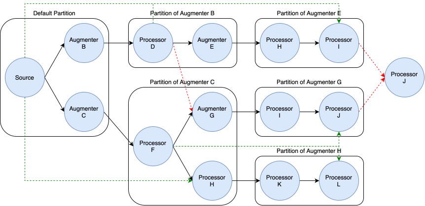

Data Augmenters
===============

Data Augmenters are the second type of node within the data flow architecture, designed to expand or reduce the dataset by generating new samples or filtering existing ones. Unlike data processors, which transform individual examples without altering dataset size, augmenters may modify the dataset's size by creating variations or removing samples. 

:code:`Hyped`'s augmentation framework is highly flexible, enabling augmentation nodes to be placed anywhere within the data flow graph. This flexibility ensures that augmentation can be seamlessly integrated into any stage of the data processing pipeline.

Design Principles
-----------------

- **Validation**: During the construction of the data flow, the framework automatically validates the graph to ensure that outputs from data augmenters are only combined with compatible values. This validation step prevents logical errors and ensures the integrity of the data flow, making it easier to integrate augmentation nodes without disrupting the overall process.
- **Seamless Integration**: The framework allows for the on-the-fly combination of augmenter outputs with compatible values. This seamless integration capability simplifies the use of augmentation nodes, enabling users to effortlessly enhance their data flows with minimal adjustments.

Data augmenters also adhere to the design principles for data processors, ensuring modularity, isolation, configurability, and clear, type-safe input/output definitions.

Flow Structure and Feature Compatibility
----------------------------------------

In the data flow architecture, maintaining a valid structure is crucial for ensuring consistent data processing and preventing errors. The framework enforces a specific structure based on the concept of partitions. A partition is defined as a subgraph within the data flow where the dataset size is guaranteed to remain constant. Each augmenter node introduces a new partition, as it may modify the dataset size by generating new samples or filtering existing ones.

To maintain a valid flow structure, the data flow must adhere to a tree-like structure at the partition level. This means that:

- **Tree Structure**: The outputs of any node within a partition should only flow into downstream partition. As long as the flow remains tree-like, the structure is considered valid.

- **Validation Mechanism**: During the construction of the data flow graph, the framework automatically validates the graph to ensure that these rules are followed. Any deviation from the tree structure, such as merging outputs from different partitions, will result in an invalid graph, which is flagged by the framework.

The diagram below illustrates an example of a valid data flow structure, including various partitions and connections. **Green lines indicate valid connections** where the tree structure is maintained, while **red lines indicate invalid connections** where incompatible outputs are combined, breaking the tree structure.

Note that the tree structure requirement applies only on partition-level. Within a partition, the data flow can be any DAG.

As seen above, a valid flow structure allows the flow of features from one (source) partition into downstream partitions. However, since dataset sizes can vary even between partitions on the same path, this poses a challenge. To address this, features from the source partition are processed along the path to the downstream partition. This process either duplicates or filters the features based on the operations of the data augmenter, ensuring the compatibility with the features in the downstream partiton.

Implementing Custom Data Augmenters
-----------------------------------

Custom data augmenters provide a way to extend the functionality of the data flow framework by implementing custom augmentation operations tailored to specific use cases. Here’s a step-by-step guide on how to implement a custom data augmenter:

1. Define Configuration
~~~~~~~~~~~~~~~~~~~~~~~

If your custom data augmenter requires configurable parameters, define a configuration class (:class:`CustomConfig`) inheriting from :class:`BaseDataAugmenterConfig`. This class allows users to customize the behavior of the augmenter by adjusting configuration parameters.

.. code-block:: python

    from hyped.core.nodes.augmenters import BaseDataAugmenterConfig

    class CustomConfig(BaseDataAugmenterConfig):
        repeat: int = 3

2. Define Input and Output References
~~~~~~~~~~~~~~~~~~~~~~~~~~~~~~~~~~~~~

Define input and output reference classes (:code:`InputRefs` and :code:`OutputRefs`). These classes specify the structure and types of input and output features expected by the data processor. Ensure that input references match the features required for processing and output references define the features generated by the processor.

.. code-block:: python

    import datasets
    from hyped.core.refs.ref import FeatureRef
    from hyped.core.refs.inputs import InputRefs, CheckFeatureEquals
    from hyped.core.refs.outputs import OutputRefs, OutputFeature
    from typing import Annotated

    class CustomAggregatorInputRefs(InputRefs):
        x: Annotated[FeatureRef, CheckFeatureEquals(datasets.Value("float32"))]
    
    class CustomAggregatorOutputRefs(OutputRefs):
        y: Annotated[FeatureRef, OutputFeature(datasets.Value("float32"))]

3. Implement Custom Augmenter
~~~~~~~~~~~~~~~~~~~~~~~~~~~~~

Create a custom augmenter class (:code:`CustomAugmenter`) inheriting from :class:`BaseDataAugmenter`. Override the :code:`process` method to define the augmentation logic for individual input samples. Access configuration values and input features within the `process` method to perform custom transformations.

.. code-block:: python

    from hyped.core.nodes.augmenter import Sample, IOContext, BaseDataAugmenter
    from typing import Iterable

    class CustomAugmenter(BaseDataAugmenter[CustomConfig, CustomInputRefs, CustomOutputRefs]):
        def process(self, inputs: Sample, index: int, rank: int, io: IOContext) -> Iterable[Sample]:
            # Access configuration values
            n = self.config.repeat
            # Yield generated samples
            for _ in range(n):
                yield Sample(y=inputs["x"])

For more information on the input arguments to the :code:`process` function, please refer to the respective chapter in the documentation on :doc:`Data Processors <data_processors>`.

**Batch Processing Example:**

By implementing the :code:`batch_process` function you can define custom batch processing logic tailored to your specific requirements.

.. code-block:: python
    
    from hyped.processors.base import Batch, IOContext, BaseDataProcessor

    class CustomAugmenter(BaseDataAugmenter[CustomConfig, CustomInputRefs, CustomOutputRefs]):
        async def batch_process(self, inputs: Batch, index: list[int], rank: int, io: IOContext) -> tuple[Batch, list[int]]:
            # Access configuration values
            n = self.config.repeat
            
            # Infer the batch size from the index
            batch_size = len(index)

            output_batch = []
            trace_index = []
            # Process each sample
            for i in range(batch_size):
                for _ in range(n):
                    output_batch.append(inputs["x"][i])
                    trace_index.append(i)

            # Custom batch processing logic
            return Batch(y=output), trace_index

The batch_process function returns a tuple consisting of the processed :code:`Batch` and a :code:`trace_index`. The :code:`Batch` represents the output data after applying the augmentation logic, while the :code:`trace_index` is a list of indices that maps each output sample back to its original position within the batch. The :code:`trace_index` is local to the current batch, providing a reference within the batch itself, whereas the input :code:`index` provided to the function is global and pertains to the dataset as a whole.

4. Instantiate and Apply the Custom Augmenter
~~~~~~~~~~~~~~~~~~~~~~~~~~~~~~~~~~~~~~~~~~~~~

Instantiate the custom augmenter with optional configuration parameters. Use the :code:`call` method to apply the augmenter to input features and retrieve the processed output features for further analysis or processing.

.. code-block:: python

    # Instantiate the custom processor
    custom_processor = CustomProcessor(CustomConfig(val=2.0))
    # Apply the custom processor to input features
    processed_features = custom_processor.call(x=flow.src_features.text)
